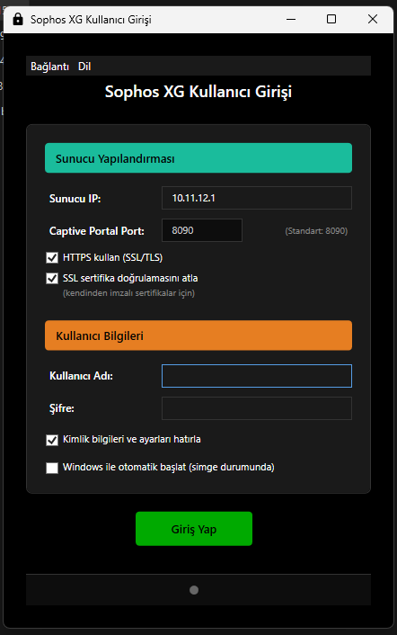

# Turnpike

Sophos XG güvenlik duvarı kimlik doğrulama oturumlarını (captive portal) yönetmek için kurumsal düzeyde güvenlik ve akıllı otomatik yeniden bağlanma özellikleri sunan çok platformlu masaüstü uygulaması. Tek bir çalıştırılabilir dosyadan hem GUI hem CLI desteği sunar.


**English**: [README_EN.md](README_EN.md)

## Ekran Görüntüsü



## Özellikler

### Çok Platformlu Destek

| Özellik | Açıklama                                        |
|---------|-------------------------------------------------|
| Windows | GUI + CLI + sistem tepsisi + otomatik başlatma  |
| macOS   | GUI + CLI + LaunchAgent ile otomatik başlatma   |
| Linux   | GUI + CLI + XDG autostart ile otomatik başlatma |

### Çift Mod (GUI + CLI)

| Mod              | Kullanım                                          |
|------------------|---------------------------------------------------|
| GUI              | Çift tıklama veya argümansız çalıştırma           |
| CLI Login        | `--login -u kullanıcı -p şifre -s sunucu`         |
| CLI Logout       | `--logout -u kullanıcı -s sunucu`                 |
| CLI Durum        | `--status`                                        |
| Kayıtlı Bilgiler | `--login --config` (kaydedilmiş kimlik bilgileri) |

### Güvenlik

| Özellik           | Açıklama                                       |
|-------------------|------------------------------------------------|
| AES-256-GCM       | Makineye özgü anahtar ile şifreleme            |
| Güvenli Depolama  | Şifrelenmiş kimlik bilgisi saklama (0600 izin) |
| SSL/TLS Desteği   | Yapılandırılabilir sertifika doğrulaması       |
| Denetim Kayıtları | Hassas veri temizlikli yapılandırılmış kayıt   |
| Bellek Temizliği  | Giriş sonrası şifre bellekten temizlenir       |

### Kullanıcı Deneyimi

| Özellik              | Açıklama                                    |
|----------------------|---------------------------------------------|
| Gerçek Zamanlı Dil   | Yeniden başlatma olmadan Türkçe/İngilizce   |
| Sistem Dili Algılama | İşletim sistemi diline göre otomatik seçim  |
| Toast Bildirimleri   | Engelleyici olmayan bildirim sistemi        |
| Sistem Tepsisi       | Asla kapanmayan arka plan çalışması         |
| True Black Tema      | OLED-optimize saf siyah tasarım             |
| Otomatik Başlat      | Platforma özgü sistem başlatma entegrasyonu |
| Otomatik Giriş       | Başlatmada otomatik kimlik doğrulama        |

### Otomatik Yeniden Bağlanma

| Özellik          | Açıklama                                      |
|------------------|-----------------------------------------------|
| Akıllı İzleme    | Arka plan oturum sağlık kontrolleri           |
| Yeniden Deneme   | 5 saniye aralıklarla 3 denemeye kadar         |
| Kullanıcı Niyeti | Manuel çıkışta otomatik bağlanmayı devre dışı |

## Hızlı Başlangıç

### Gereksinimler

| Platform | Gereksinimler                                 |
|----------|-----------------------------------------------|
| Windows  | Windows 7 veya üzeri                          |
| macOS    | macOS 10.14 veya üzeri                        |
| Linux    | X11 veya Wayland destekli masaüstü            |
| Ortak    | Güvenlik duvarına ağ erişimi (captive portal) |

### Kurulum

1. En son sürümü indirin veya kaynaktan derleyin
2. Çalıştırılabilir dosyayı çalıştırın (GUI otomatik açılır)
3. Güvenlik duvarı sunucu ayarlarınızı yapılandırın

### İlk Yapılandırma

| Adım             | İşlem                                         |
|------------------|-----------------------------------------------|
| Sunucu Ayarları  | IP adresi, port (varsayılan: 8090), HTTPS/SSL |
| Kimlik Bilgileri | Kullanıcı adı, parola, "Hatırla" seçeneği     |
| Dil Tercihi      | Menü üzerinden Türkçe/İngilizce seçimi        |

### Önemli Davranışlar

| Eylem             | Sonuç                                    |
|-------------------|------------------------------------------|
| X Butonuna Bas    | Sistem tepsisine küçültme (kapanmaz)     |
| Tepsi Sağ Tık     | "Kapat" ile gerçek kapatma               |
| Sistem Başlangıcı | Otomatik olarak sistem tepsisinde başlar |
| Enter Tuşu        | Giriş işlemini başlatır                  |

## CLI Kullanımı

```bash
# GUI modu (varsayılan)
turnpike
turnpike --gui
turnpike --gui --minimized

# Giriş
turnpike --login -u admin -p şifre -s 172.16.100.2
turnpike --login -u admin -s 172.16.100.2          # şifre interaktif sorulur
turnpike --login --config                           # kaydedilmiş bilgilerle

# Çıkış
turnpike --logout -u admin -s 172.16.100.2

# Durum kontrolü
turnpike --status

# Versiyon
turnpike --version
```

### CLI Çıkış Kodları

| Kod | Anlam                   |
|-----|-------------------------|
| 0   | Başarılı                |
| 1   | Genel hata              |
| 2   | Kimlik doğrulama hatası |

## Derleme

### Kaynaktan Derleme

```bash
go build ./cmd/turnpike/
```

### Testleri Çalıştırma

```bash
go test ./internal/... -count=1
```

| Bilgi         | Değer                  |
|---------------|------------------------|
| Dil           | Go 1.22+               |
| GUI Framework | Fyne v2.4.4            |
| Test Sayısı   | 189 (8 paket)          |
| Giriş Noktası | `cmd/turnpike/main.go` |

## Mimari

### Proje Yapısı

```
cmd/turnpike/         Giriş noktası, CLI/GUI yönlendirmesi
internal/
  auth/               Captive portal kimlik doğrulama servisi
  cli/                CLI komut işleyicileri, şifre istemi
  config/             Sabitler, kimlik bilgisi yönetimi
  security/           AES-256-GCM şifreleme
  logging/            Dosya kayıt servisi (10MB rotasyon)
  i18n/               Türkçe/İngilizce yerelleştirme (65+ anahtar)
  autostart/          Platform-özgü otomatik başlatma
  ui/                 Fyne GUI, OLED tema, bildirimler
```

### Kimlik Doğrulama Akışı

```
Giriş:    POST {server}:8090/login   (form-encoded, mode=191)
Çıkış:    POST {server}:8090/logout  (form-encoded, mode=193)
Kontrol:  GET  msftconnecttest.com/connecttest.txt
```

### Güvenlik Mimarisi

| Bileşen          | Açıklama                                         |
|------------------|--------------------------------------------------|
| AES-256-GCM      | Makine kimliğinden türetilen anahtarla şifreleme |
| Güvenli Kayıt    | URL ve hassas veri otomatik temizliği            |
| Bellek Güvenliği | Giriş sonrası şifre bellekten temizlenir         |
| Dosya İzinleri   | Kimlik bilgisi dosyası 0600 izinleriyle saklanır |
| SSL İzolasyonu   | SSL bypass yalnızca auth istemcisine uygulanır   |

## Veri Depolama

| Dosya                   | Konum      | Açıklama                           |
|-------------------------|------------|------------------------------------|
| `user_credentials.json` | Exe dizini | AES-256-GCM şifreli kimlik bilgisi |
| `turnpike.log`          | Exe dizini | 10MB otomatik rotasyon             |

**Tam Taşınabilirlik**: Tüm veriler çalıştırılabilir dosya ile birlikte hareket eder.

## Yerelleştirme

| Dil       | Durum            |
|-----------|------------------|
| Türkçe    | Tam çeviri (65+) |
| İngilizce | Tam çeviri (65+) |

Dil değişimi anlık, yeniden başlatma gerektirmez ve tercih kalıcı olarak saklanır.

## Lisans

Bu proje açık kaynaktır.