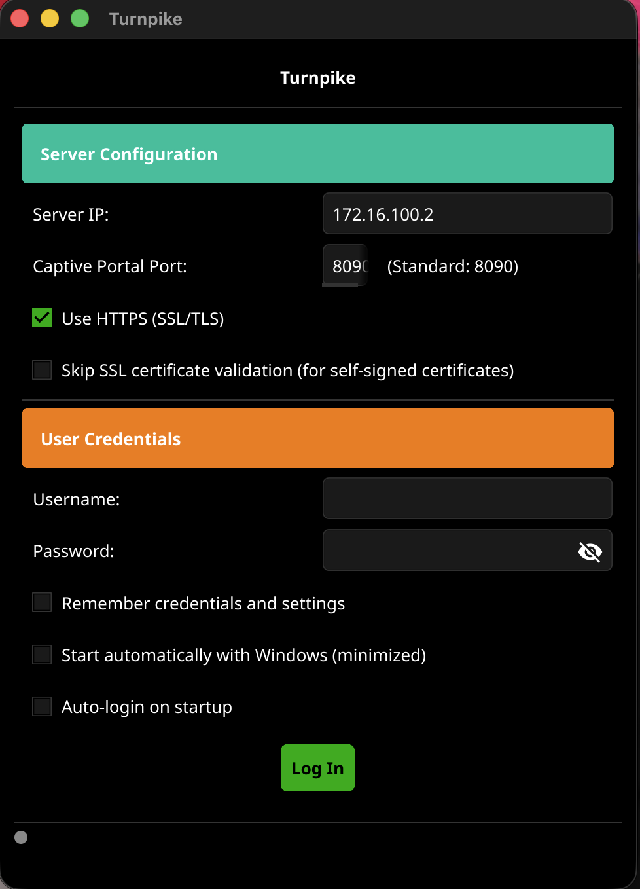

# Turnpike

A cross-platform desktop application for managing Sophos XG firewall captive portal authentication sessions with enterprise-grade security and intelligent auto-reconnection capabilities. Supports both GUI and CLI modes from a single binary.


**Türkçe**: [README.md](README.md)

## Screenshot



## Features

### Cross-Platform Support

| Platform | Description                                   |
|----------|-----------------------------------------------|
| Windows  | GUI + CLI + system tray + registry auto-start |
| macOS    | GUI + CLI + LaunchAgent auto-start            |
| Linux    | GUI + CLI + XDG autostart                     |

### Dual Mode (GUI + CLI)

| Mode              | Usage                                       |
|-------------------|---------------------------------------------|
| GUI               | Double-click or run without arguments       |
| CLI Login         | `--login -u user -p pass -s server`         |
| CLI Logout        | `--logout -u user -s server`                |
| CLI Status        | `--status`                                  |
| Saved Credentials | `--login --config` (uses saved credentials) |

### Security

| Feature         | Description                                         |
|-----------------|-----------------------------------------------------|
| AES-256-GCM     | Machine-derived key encryption                      |
| Secure Storage  | Encrypted credential storage (0600 permissions)     |
| SSL/TLS Support | Configurable certificate validation                 |
| Audit Logging   | Structured logging with sensitive data sanitization |
| Memory Clearing | Password cleared from memory after login            |

### User Experience

| Feature                 | Description                                  |
|-------------------------|----------------------------------------------|
| Real-time Language      | English/Turkish switching without restart    |
| System Locale Detection | Automatic language based on OS locale        |
| Toast Notifications     | Non-blocking notification system             |
| System Tray             | Never-closing background operation           |
| True Black Theme        | OLED-optimized pure black design             |
| Auto-Start              | Platform-specific system startup integration |
| Auto-Login              | Automatic authentication on startup          |

### Auto-Reconnection

| Feature          | Description                              |
|------------------|------------------------------------------|
| Smart Monitoring | Background session health checks         |
| Retry Logic      | Up to 3 attempts with 5-second intervals |
| User Intent      | Disables auto-reconnect on manual logout |

## Quick Start

### Prerequisites

| Platform | Requirements                              |
|----------|-------------------------------------------|
| Windows  | Windows 7 or higher                       |
| macOS    | macOS 10.14 or higher                     |
| Linux    | X11 or Wayland-supported desktop          |
| Common   | Network access to captive portal firewall |

### Installation

1. Download the latest release or build from source
2. Run the executable (GUI opens automatically)
3. Configure your firewall server settings

### First Time Setup

| Step                | Action                                      |
|---------------------|---------------------------------------------|
| Server Settings     | IP address, port (default: 8090), HTTPS/SSL |
| Credentials         | Username, password, "Remember" option       |
| Language Preference | Select English/Turkish from menu            |

### Important Behaviors

| Action           | Result                                    |
|------------------|-------------------------------------------|
| Click X Button   | Minimizes to system tray (does not close) |
| Tray Right-Click | "Exit" for actual termination             |
| System Startup   | Automatically starts minimized in tray    |
| Enter Key        | Triggers login action                     |

## CLI Usage

```bash
# GUI mode (default)
turnpike
turnpike --gui
turnpike --gui --minimized

# Login
turnpike --login -u admin -p pass -s 172.16.100.2
turnpike --login -u admin -s 172.16.100.2          # password prompted interactively
turnpike --login --config                           # use saved credentials

# Logout
turnpike --logout -u admin -s 172.16.100.2

# Status check
turnpike --status

# Version
turnpike --version
```

### CLI Exit Codes

| Code | Meaning                |
|------|------------------------|
| 0    | Success                |
| 1    | General error          |
| 2    | Authentication failure |

## Building

### Build from Source

```bash
go build ./cmd/turnpike/
```

### Run Tests

```bash
go test ./internal/... -count=1
```

| Property      | Value                  |
|---------------|------------------------|
| Language      | Go 1.22+               |
| GUI Framework | Fyne v2.4.4            |
| Test Count    | 189 (8 packages)       |
| Entry Point   | `cmd/turnpike/main.go` |

## Architecture

### Project Structure

```
cmd/turnpike/         Entry point, CLI/GUI routing
internal/
  auth/               Captive portal authentication service
  cli/                CLI command handlers, password prompt
  config/             Constants, credential management
  security/           AES-256-GCM encryption
  logging/            File logging service (10MB rotation)
  i18n/               Turkish/English localization (65+ keys)
  autostart/          Platform-specific auto-start
  ui/                 Fyne GUI, OLED theme, notifications
```

### Authentication Flow

```
Login:  POST {server}:8090/login   (form-encoded, mode=191)
Logout: POST {server}:8090/logout  (form-encoded, mode=193)
Check:  GET  msftconnecttest.com/connecttest.txt
```

### Security Architecture

| Component        | Description                                   |
|------------------|-----------------------------------------------|
| AES-256-GCM      | Encryption with machine-derived key           |
| Secure Logging   | Automatic URL and sensitive data sanitization |
| Memory Security  | Password cleared from memory after login      |
| File Permissions | Credentials stored with 0600 permissions      |
| SSL Isolation    | SSL bypass scoped to auth client only         |

## Data Storage

| File                    | Location      | Description                       |
|-------------------------|---------------|-----------------------------------|
| `user_credentials.json` | Exe directory | AES-256-GCM encrypted credentials |
| `turnpike.log`          | Exe directory | 10MB automatic rotation           |

**Full Portability**: All data travels with the executable.

## Localization

| Language | Status              |
|----------|---------------------|
| English  | Full coverage (65+) |
| Turkish  | Full coverage (65+) |

Language switching is instant, requires no restart, and the preference is persisted across sessions.

## License

This project is open source.